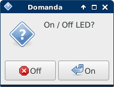
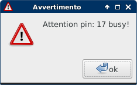
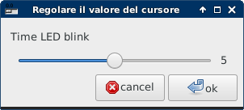
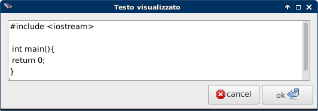
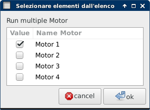
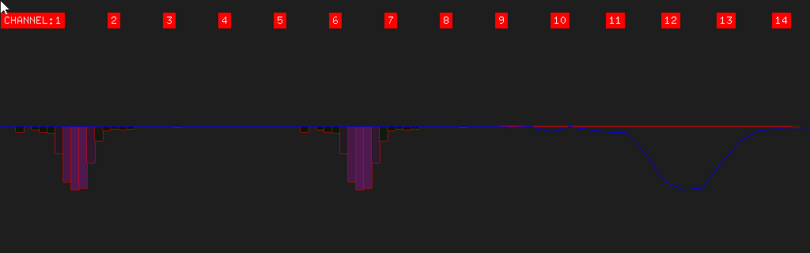

A small library in C++ for the use of GPIO raspberrypi (A/B/2/3/Zero) orangepi (one/zero/plus) this library is compatible with the toolkit for creative coding <a href="http://openframeworks.cc/">Openframeworks</a>. Interface GPIO: SPI (Serial Peripheral Interface), I2C (Inter Integrated Circuit), IO Pin read/write. Recently added a small class "Zenity" to draw faster gui for the control of your projects and support for bcm2835. 

<b><a href="http://www.ziggurats.net/port.php?port=ofxGPIO" target="_blank">Documentation</a></b>

<table border="1">
<tr>
<td></td><td></td><td></td>
</tr>
<tr>
<td></td><td></td><td></td>
</tr>
</table>

<table border="1">
<tr>
<td></td><td></td><td></td>
</tr>
<tr>
<td></td><td></td><td></td>
</tr>
</table>

<!--<table>
<tr>
<td align="center"></td>
</tr>
</table>-->

<table border="1">
<tr>
<td></td><td></td>
</tr>
</table>

<!--

 -->

Example scanner with nRF24L01:
	<ul>
		<li>Raspberry pi (2/3/Zero/A/A+/B+)
		<li>nRF24L01</li>
	</ul>
fritzing example:

Example simple Button Read state:
	<ul>
		<li>Raspberry pi (2/3/Zero/A/A+/B+)
		<li>Button</li>
	</ul>
fritzing example:

Example simple Led Blink:
	<ul>
		<li>Raspberry pi (2/3/Zero/A/A+/B+)
		<li>Led</li>
	</ul>
fritzing example:

Example simple Relay on / off Light:
	<ul>
		<li>Raspberry pi (2/3/Zero/A/A+/B+)
		<li>Relay 5v</li>
		<li>Lamp</li>
	</ul>
fritzing example:

Example GPS UART:
	http://aprs.gids.nl/nmea/
	<ul>
		<li>Raspberry pi (2/3/Zero/A/A+/B+)
		<li>GPS breakout v3</li>
	</ul>
fritzing example:

Example i2c multiple byte read MPU6050:
	<ul>
		<li>Raspberry pi (2/3/Zero/A/A+/B+)
		<li>MPU6050</li>
	</ul>
fritzing example:

Example Led Matrix8x8:
        <ul>
                <li>Raspberry pi (2/3/Zero/A/A+/B+)
                <li>Led Matrix</li>
        </ul>
fritzing example:

Example Servo motor(Attention raspberry not to have pin PWM, for this we use a CLK pin, advice integrated pwm):
        <ul>
                <li>Raspberry pi (2/3/Zero/A/A+/B+)
                <li>Servo Motor</li>
        </ul>
fritzing example:

Example GPIO read/write stepper rotation:
	<ul>
	<li>Raspberry PI</li>
	<li>Stepper Motor bipolar</li>
	<li>sn754410ne H-Bridge</li>
	<li>Button</li>
	<li>wiring</li>
	</ul>
 
fritzing example:

sn754410ne H-Bridge:
 

 
video: <a href="http://www.youtube.com/watch?v=lwRd5D9EuU0">http://www.youtube.com/watch?v=lwRd5D9EuU0</a>

  

Example GPIO I2C communication:
	<ul>
	<li>Raspberry PI</li>
	<li>Arduino</li>
	<li>LED</li>
	<li>Resistor 75 ohm</li>
	<li>wiring</li>
	</ul>
 
fritzing example:

 
video: <a href="http://www.youtube.com/watch?v=SRz750EdjfY">http://www.youtube.com/watch?v=SRz750EdjfY</a>

  

Example GPIO SPI add Analog pin MCP3008 potentiometer:
	<ul>
	<li>Raspberry</li>
	<li>MCP3008</li>
	<li>Potentiometer</li>
	<li>wiring</li>
	</ul>
 
fritzing example:

MCP3008 8-Channel 10-Bit ADC
 

 
video: <a href="http://www.youtube.com/watch?v=PkDkCJyZ2go">http://www.youtube.com/watch?v=PkDkCJyZ2go</a>

 
for i2c and SPI configuration visit this page:

https://learn.adafruit.com/adafruits-raspberry-pi-lesson-4-gpio-setup/configuring-spi
 
https://learn.adafruit.com/adafruits-raspberry-pi-lesson-4-gpio-setup/configuring-i2c

   
<b><h1>Datasheet integrated list:</h1></b>

<b>Drive motor:</b> 
http://www.ti.com/lit/ds/symlink/l293.pdf 
http://www.ti.com/lit/ds/symlink/sn754410.pdf 
http://www.ti.com/lit/ds/symlink/uln2003a.pdf 
http://www.st.com/content/ccc/resource/technical/document/datasheet/f3/6e/c8/64/4d/b3/4e/38/CD00001244.pdf/files/CD00001244.pdf/jcr:content/translations/en.CD00001244.pdf
  

<b>Motor stepper Bipolar / Unipolar:</b> 
http://motion.schneider-electric.com/downloads/datasheets/14_mtr.pdf 
http://www.mitsumi.co.jp/latest/Catalog/pdf/motor_m35sp_9_e.pdf
  

<b>A/D Converters:</b> 
https://cdn-shop.adafruit.com/datasheets/MCP3008.pdf 
http://ww1.microchip.com/downloads/en/DeviceDoc/21295C.pdf
  

<b>ATmega48A/PA/88A/PA/168A/PA/328/P:</b> 
http://www.atmel.com/images/Atmel-8271-8-bit-AVR-Microcontroller-ATmega48A-48PA-88A-88PA-168A-168PA-328-328P_datasheet_Complete.pdf
  

<b>MPU-6000 / MPU-6050:</b> 
https://www.cdiweb.com/datasheets/invensense/MPU-6050_DataSheet_V3%204.pdf
  

<b>Adafruit Ultimate GPS:</b> 
https://cdn-learn.adafruit.com/downloads/pdf/adafruit-ultimate-gps.pdf
  

<b>Adafruit LED Backpacks:</b> 
https://cdn-learn.adafruit.com/downloads/pdf/adafruit-led-backpack.pdf
  

<b>EEPROM</b> 
http://www.bucek.name/pdf/24c16.pdf
http://www.st.com/content/ccc/resource/technical/document/datasheet/5c/df/52/a5/15/f2/48/bd/CD00259166.pdf/files/CD00259166.pdf/jcr:content/translations/en.CD00259166.pdf

